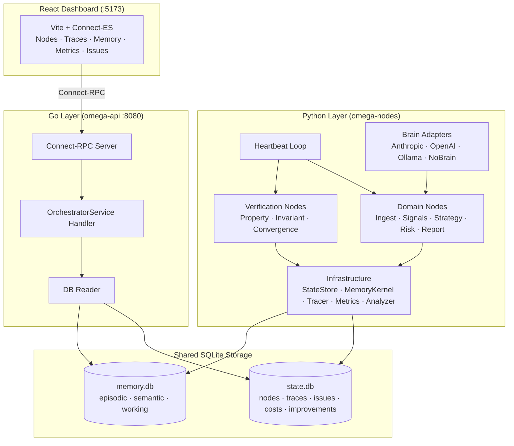
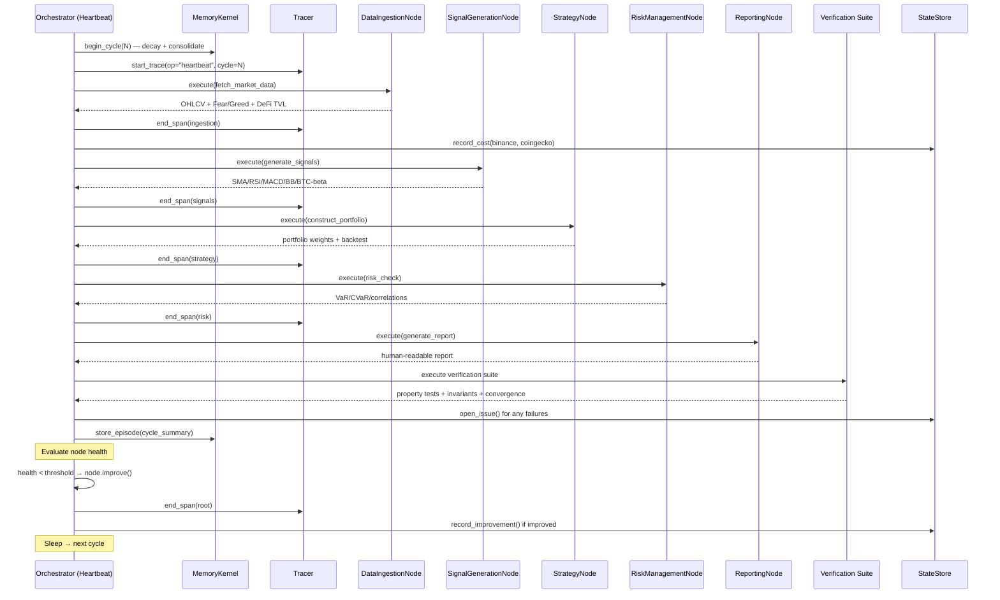
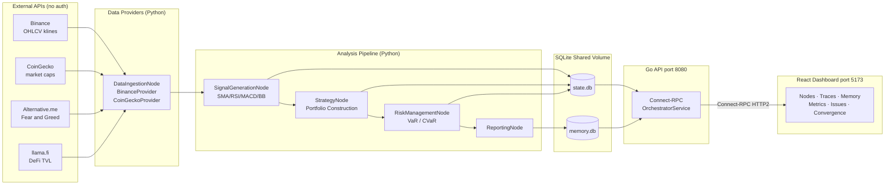

# Project Omega — Architecture

Project Omega is a self-improving AI node orchestration framework. Nodes execute domain logic, observe their own performance, and iteratively improve themselves. A Go Connect-RPC API exposes live state to a React dashboard.

---

## 1. High-Level System Architecture



---

## 2. Heartbeat Loop Flow

Each heartbeat cycle runs the full pipeline in sequence, then evaluates health and triggers self-improvement if needed.



---

## 3. Subsystem Interaction Map

The five core subsystems interact in a feedback loop. Each arrow represents a data dependency or control signal.

```mermaid
graph LR
    subgraph Goals["Goal System"]
        GS[GoalSpec<br/>metrics + weights]
        EVAL[Evaluator<br/>score computation]
    end

    subgraph Alignment["Alignment"]
        HEALTH[Health Tracker<br/>per-node scores]
        IMPROVE[Improvement Engine<br/>node.improve()]
    end

    subgraph Adversarial["Adversarial"]
        RINGS[Challenge Rings<br/>veto / stress-test]
    end

    subgraph Memory["Memory"]
        EP[Episodic Memory<br/>cycle summaries]
        SEM[Semantic Memory<br/>learned patterns]
        WM[Working Memory<br/>intra-cycle context]
    end

    subgraph Observability["Observability"]
        SS2[StateStore<br/>SQLite]
        TRC2[Tracer<br/>spans to SQLite]
        MET[MetricsCollector<br/>rolling aggregates]
        ANA[SystemAnalyzer<br/>recommendations]
    end

    GS --> EVAL
    EVAL --> HEALTH
    HEALTH --> IMPROVE
    IMPROVE --> RINGS
    RINGS -->|veto/approve| IMPROVE

    IMPROVE --> EP
    EP --> SEM
    SEM --> IMPROVE

    HEALTH --> SS2
    TRC2 --> SS2
    MET --> SS2
    ANA --> MET
    ANA --> SS2

    WM -->|intra-cycle state| EVAL
```

---

## 4. Data Flow Diagram

External market data flows through the Python pipeline, is persisted to SQLite, and served to the browser via the Go API.



---

## Key Design Decisions

| Decision | Rationale |
|---|---|
| SQLite shared volume | Zero network overhead; Python writes, Go reads; WAL mode enables concurrent readers |
| stdlib-only Python deps | No external packages needed — `sqlite3`, `urllib`, `dataclasses`, `logging` cover everything |
| Connect-RPC over REST | Type-safe, proto-defined API shared between Go server and TypeScript client via code generation |
| OpenTelemetry-inspired tracing | Spans persist to SQLite so the dashboard can render waterfalls without a separate trace backend |
| 12-factor JSON logging | Structured logs are machine-parseable; pipe to any log aggregator (Loki, CloudWatch, Datadog) |
| Config from env vars + optional YAML | Twelve-factor compliance; YAML for local dev, env vars for Docker / CI |
