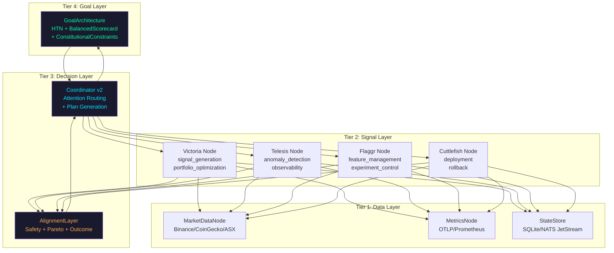
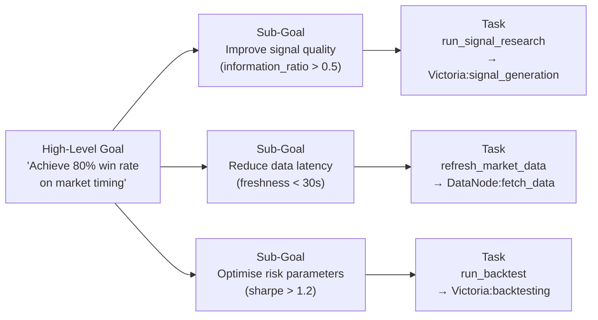
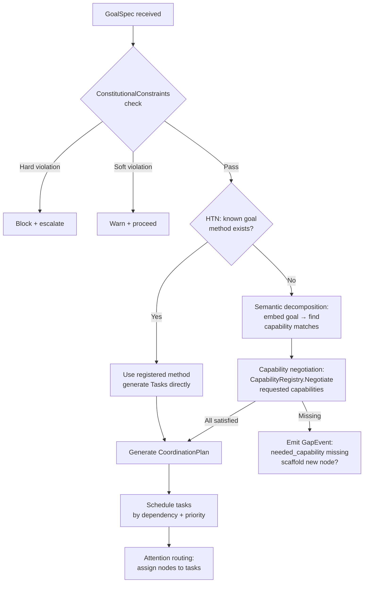
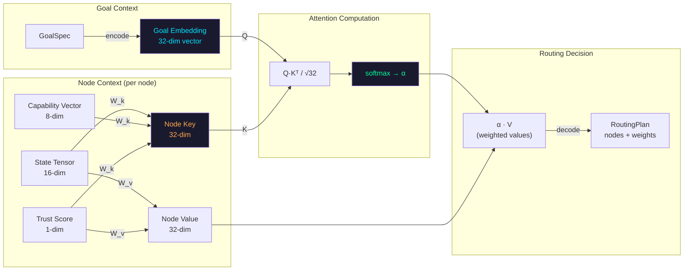
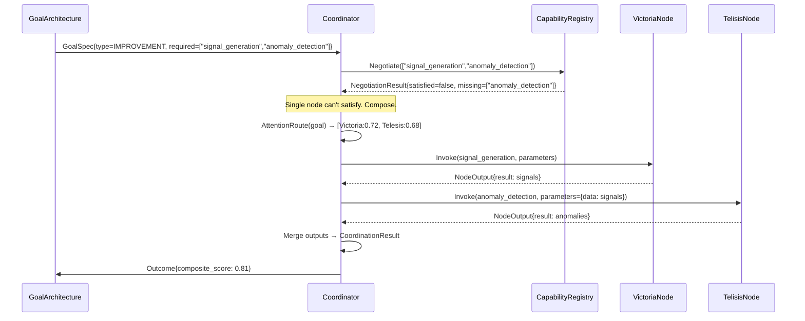
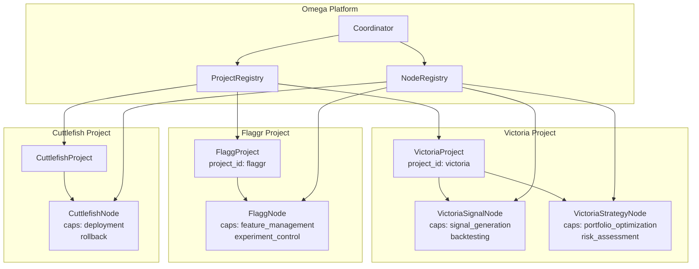
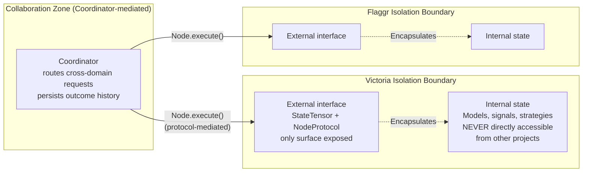
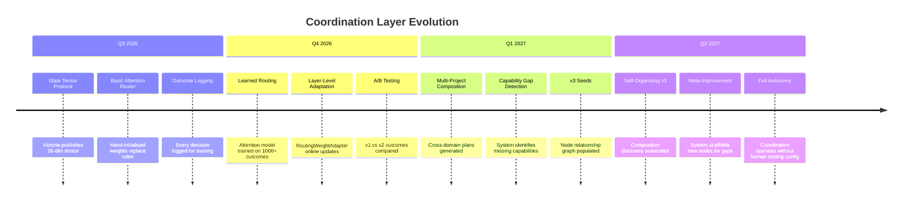

# Coordination Layer v2 — Architecture Specification

> **Status:** Draft — 2026-03-23
> **Scope:** Coordination Layer v2 (EPIC-016) with foundational context for v1 (EPIC-010) and v3 (EPIC-021)
> **Audience:** Implementation engineers, system architects

---

## Executive Summary

Omega's coordination layer is the mechanism that makes a collection of independent capability nodes behave as a unified, goal-directed intelligence. This document formalises the neural network analogy as a precise engineering architecture, specifies the data protocols that enable it, and provides a concrete implementation roadmap.

The central claim: **a small transformer-style attention mechanism over node state tensors, trained on (goal, state, plan, outcome) tuples, can replace hand-written routing rules and self-improve as the system accumulates experience.** This is achievable without ML infrastructure — the model is small enough to train offline in Go using only standard matrix operations and inference at coordination time in microseconds.

---

## Table of Contents

1. [The Neural Network Analogy Formalized](#1-the-neural-network-analogy-formalized)
2. [Goal Decomposition Protocol](#2-goal-decomposition-protocol)
3. [State Tensor Protocol](#3-state-tensor-protocol)
4. [Attention-Based Routing](#4-attention-based-routing)
5. [Self-Improvement at Multiple Scales](#5-self-improvement-at-multiple-scales)
6. [Multi-Project Coordination](#6-multi-project-coordination)
7. [Implementation Roadmap](#7-implementation-roadmap)

---

## 1. The Neural Network Analogy Formalized

### 1.1 Conceptual Mapping

The analogy is not metaphorical — each element maps to a concrete engineering primitive:

| Neural Concept | Omega Primitive | Code Location |
|---|---|---|
| Neuron | `Node` (implements `Node` ABC) | `omega/core/node.py`, `internal/framework/capability.go` |
| Activation function | `Node.execute()` | `omega/core/node.py:269` |
| Neuron output | `NodeOutput.result` | `omega/core/node.py:61` |
| Synaptic weight | Trust score × capability match score | `omega/core/autonomy.py` |
| Activation value | `NodeState` / state tensor | `omega/core/node.py:34` |
| Connectivity matrix | `NodeRegistry` + routing weights | `omega/core/registry.py` |
| Attention mechanism | Coordinator (v2): Q×K×V routing | *This spec* |
| Backpropagation | Outcome feedback → routing weight updates | *This spec* |
| Inhibitory neuron | Adversarial layer / circuit breaker | `omega/core/adversarial_v2.py`, `internal/core/node_circuit.go` |
| Layer | Coordination tier (see below) | *This spec* |

### 1.2 Coordination Tiers (Layers)

The system organises into four tiers. Unlike strict feed-forward networks, information flows up, down, and sideways — this is closer to a cortical column than a simple MLP.



**Tier 1 (Data):** Raw data sources. Nodes here poll, cache, and normalise market data, metrics, and state. No intelligence, just reliable data contracts.

**Tier 2 (Signal):** Domain capability nodes. Each node has defined capabilities (verb list), a state tensor, and executes domain logic. Victoria generates signals; Telesis detects anomalies; Flaggr manages experiments; Cuttlefish deploys models. These are the "neurons."

**Tier 3 (Decision):** The coordinator reads Tier 2 state tensors, evaluates goal context, and routes work. The alignment layer acts as a safety gate on all outbound decisions. This is where the attention mechanism lives.

**Tier 4 (Goal):** The `GoalArchitecture` (already implemented in `omega/core/goals.py`) operates here — constitutional constraints, balanced scorecard, HTN decomposition. It produces `GoalDecision` objects that drive Tier 3.

### 1.3 Node as Neuron — The Formal Contract

A node exposes three surfaces to the coordination layer:

```
Node = {
  Identity:    (node_id, name, version, domain)
  Capabilities: [verb_1, verb_2, ..., verb_n]  -- what it can do
  State Tensor: float32[D]                      -- how it is right now
  Trust:       float32 ∈ [0.0, 1.0]            -- how much to rely on it
}
```

The state tensor is the "activation" — the coordinator reads it when deciding whether and how to route work to this node. A node with `signal_quality=0.12` looks very different to the coordinator than one with `signal_quality=0.87`, even if both advertise `signal_generation` capability.

The key insight from MoE (Mixture of Experts) literature: **the router (coordinator) should select experts (nodes) based on current state, not just static capability tags.** This is exactly what attention-based routing achieves.

---

## 2. Goal Decomposition Protocol

### 2.1 Overview

The `GoalArchitecture` (already in `omega/core/goals.py`) implements three layers:
1. **ConstitutionalConstraints** — hard blocking gates (drawdown > 15%, position > 25%)
2. **BalancedScorecard** — multi-dimensional tracking (returns, risk, diversification, information_ratio)
3. **HTNDecomposer** — hierarchical task network decomposition

This spec extends the HTN with **semantic goal embedding** and **capability negotiation** so the coordinator can decompose novel goals that weren't hand-coded into the HTN's method registry.

### 2.2 Goal Hierarchy



### 2.3 Goal Decomposition Protocol (GDP)

```protobuf
// omega/v1/goals.proto

message GoalSpec {
  string goal_id         = 1;
  string description     = 2;   // natural-language description
  GoalType type          = 3;
  repeated Metric targets = 4;  // measurable success criteria
  map<string, float> context = 5;  // current metric values
  float priority         = 6;   // 0.0–1.0
  string parent_goal_id  = 7;   // for sub-goal hierarchy
  repeated string required_capabilities = 8;  // verbs needed
  google.protobuf.Timestamp deadline = 9;
  // requires_autonomy: true means the goal involves irreversible actions
  // and routing must prefer nodes with trust_score >= 0.7.
  bool requires_autonomy = 10;
}

enum GoalType {
  GOAL_TYPE_UNSPECIFIED    = 0;
  GOAL_TYPE_RESEARCH       = 1;   // hypothesis → experiment → evaluate
  GOAL_TYPE_IMPROVEMENT    = 2;   // improve a specific metric
  GOAL_TYPE_MAINTENANCE    = 3;   // keep a metric within bounds
  GOAL_TYPE_INCIDENT       = 4;   // respond to a safety violation or anomaly
  GOAL_TYPE_COMPOSITION    = 5;   // cross-node composition goal
}

message Metric {
  string name      = 1;
  float  target    = 2;
  string direction = 3;  // "maximize" | "minimize" | "maintain"
  float  weight    = 4;
}

message GoalDecomposition {
  string goal_id           = 1;
  repeated SubGoal subgoals = 2;
  repeated Task    tasks    = 3;
  string method_used        = 4;  // HTN method name or "semantic"
  float  confidence         = 5;
}

message SubGoal {
  string subgoal_id  = 1;
  string parent_id   = 2;
  GoalSpec spec      = 3;
}

message Task {
  string task_id         = 1;
  string name            = 2;
  map<string, string> parameters = 3;
  string assigned_node_id = 4;
  string capability       = 5;
  float  priority         = 6;
  repeated string depends_on = 7;  // other task_ids
  map<string, string> preconditions = 8;
}
```

### 2.4 Decomposition Flow



### 2.5 Convergence Criteria

The system knows it's making progress by consulting `omega/core/convergence.py`. Note the API distinction:

**Module-level functions** (operate on raw score sequences):
- `improvement_rate(scores, window=20)` — positive means still improving
- `has_plateaued(scores, epsilon=0.01, window=20)` — true when improvement < epsilon
- `beats_random(tpe_scores, random_scores, confidence=0.95)` — two-sequence comparison

**`ConvergenceDiagnostics` class** (stateful wrapper — records scores internally):
- `diag.record(score)` — appends a trial score
- `diag.has_converged(epsilon, window)` — equivalent to `has_plateaued` on recorded scores
- `diag.beats_random(random_scores)` — compares self._scores vs supplied random_scores

For coordination-level convergence (not just TPE convergence), we extend with:

```python
@dataclass
class CoordinationConvergence:
    """Tracks whether goal-level metrics are converging."""
    goal_id: str
    metric_history: dict[str, list[float]]  # metric_name → [values per cycle]

    def goal_progress(self, metric: str, target: float, window: int = 10) -> float:
        """Progress toward target: 0.0 = no progress, 1.0 = target met."""
        values = self.metric_history.get(metric, [])[-window:]
        if not values:
            return 0.0
        current = values[-1]
        initial = values[0]
        if target == initial:
            return 1.0 if current == target else 0.0
        return max(0.0, min(1.0, (current - initial) / (target - initial)))

    def is_stuck(self, metric: str, window: int = 20, epsilon: float = 0.01) -> bool:
        """True if the metric hasn't meaningfully moved in `window` cycles."""
        values = self.metric_history.get(metric, [])
        return has_plateaued(values, epsilon=epsilon, window=window)
```

### 2.6 Feedback Propagation

Outcomes from executed plans flow back through the system in two channels:

**Immediate (same cycle):**
- Node health updated: `NodeHealth.record(health, success)`
- Adversarial score updated
- Autonomy promotion check: `GraduatedAutonomyController.record_cycle()`

**Deferred (end of cycle / consolidation):**
- `MemoryKernel.store_episode()` records outcome as episodic memory
- `MemoryKernel.consolidate()` extracts semantic patterns every N cycles
- Routing weight update: `(goal_type, node_id, outcome_score)` tuple stored for attention model training

The critical insight: **the routing model does not need real-time gradient descent.** It is trained offline on accumulated (goal, state_tensor, plan, outcome) history and hot-swapped. This keeps the coordination loop deterministic and low-latency.

---

## 3. State Tensor Protocol

### 3.1 Design Principles

A state tensor is a **typed, versioned, numeric snapshot** of a node's current state. It serves two roles:
1. **Runtime routing signal** — the coordinator reads it to decide how much weight to give this node
2. **Training data** — tensors at time T, combined with outcomes at time T+k, train the attention routing model

Requirements:
- Fixed-width float32 array (schema defines dimension semantics)
- Schema versioned independently from node software
- Must be serialisable in < 1ms
- Human-interpretable dimension names (for dashboard visualisation and debugging)

### 3.2 Protobuf Schema

```protobuf
// proto/omega/v1/state_tensor.proto

syntax = "proto3";
package omega.v1;

import "google/protobuf/timestamp.proto";

// StateTensorDimension describes one dimension of a state tensor.
message StateTensorDimension {
  string name        = 1;  // e.g. "signal_quality"
  string description = 2;  // human-readable semantics
  float  range_min   = 3;  // expected minimum value
  float  range_max   = 4;  // expected maximum value
  string unit        = 5;  // "fraction", "ms", "count", "score", "bool"
  bool   is_health   = 6;  // true = this is a health/trust signal, not domain data
}

// StateTensorSchema declares the shape and semantics of a node's state tensor.
// Versioned separately so the schema can evolve without changing node software.
message StateTensorSchema {
  string node_type     = 1;  // e.g. "victoria", "telesis"
  string schema_version = 2; // semver, e.g. "1.2.0"
  repeated StateTensorDimension dimensions = 3;
  // Aggregate health: weighted mean of is_health dimensions.
  // Used by coordinator when detailed tensor unavailable.
  repeated string health_dimension_names = 4;
}

// StateTensor is a snapshot of node state at a point in time.
message StateTensor {
  string node_id             = 1;
  string schema_version      = 2;
  google.protobuf.Timestamp captured_at = 3;
  // float32 values in dimension order defined by StateTensorSchema.
  // Stored as raw bytes (little-endian float32 array) for efficiency.
  bytes  values              = 4;
  // Convenience: named dimensions for sparse access without schema lookup.
  map<string, float> named   = 5;
  // Aggregate scalar health score derived from health_dimension_names.
  float  health_score        = 6;
}

// StateTensorHistory is a ring buffer of recent state snapshots.
// Stored per node in NATS JetStream.
message StateTensorHistory {
  string node_id    = 1;
  int32  max_size   = 2;  // default 1000
  repeated StateTensor snapshots = 3;
}
```

### 3.3 Victoria State Tensor — Reference Implementation

Victoria's 16-dimensional state tensor (first reference implementation):

| Dim | Name | Range | Unit | Is Health | Description |
|---|---|---|---|---|---|
| 0 | `signal_quality` | 0–1 | score | ✓ | Ensemble signal quality score (current cycle) |
| 1 | `cycle_health` | 0–1 | fraction | ✓ | Fraction of pipeline steps that succeeded |
| 2 | `data_freshness` | 0–1 | score | ✓ | 1.0 = data < 60s old; 0.0 = data > 1h old |
| 3 | `adversarial_score` | 0–1 | score | ✓ | 1 − max_disagreement from Ring 1 |
| 4 | `improvement_trend` | −1–1 | score | ✗ | EMA of recent improvement deltas |
| 5 | `active_experiments` | 0–20 | count | ✗ | Number of active TPE experiments |
| 6 | `last_sharpe` | −3–5 | score | ✗ | Most recent Sharpe ratio (normalised) |
| 7 | `max_drawdown` | 0–1 | fraction | ✓ | Current max drawdown (lower = healthier) |
| 8 | `signal_coverage` | 0–1 | fraction | ✗ | Fraction of universe with valid signals |
| 9 | `error_rate` | 0–1 | fraction | ✓ | Pipeline error rate (last 20 cycles) |
| 10 | `autonomy_level` | 0–2 | ordinal | ✗ | 0=PICO, 1=SUPERVISED, 2=AUTONOMOUS |
| 11 | `regime_label` | 0–3 | ordinal | ✗ | Current market regime (encoded) |
| 12 | `trust_score` | 0–1 | score | ✓ | Computed trust score from outcome history |
| 13 | `memory_utilisation` | 0–1 | fraction | ✗ | Episodic memory fill rate |
| 14 | `cycles_since_improvement` | 0–1 | score | ✗ | 0 = just improved; 1 = > 50 cycles ago |
| 15 | `lm_consultation_rate` | 0–1 | fraction | ✗ | Fraction of decisions using LLM brain |

### 3.4 Streaming Protocol

State tensors are published to NATS on every node heartbeat:

```
Subject:  omega.nodes.{node_id}.state
Format:   StateTensor protobuf (binary)
QoS:      JetStream persistent, last-value cache per node
Retention: 1000 messages per node (ring buffer)
```

The coordinator subscribes to `omega.nodes.*.state` and maintains an in-memory map of `node_id → StateTensor` that is always the latest known state.

### 3.5 Aggregation Functions

For coordinator-level views across all nodes:

```go
// AggregateNodeStates computes system-level metrics from all node tensors.
type TensorAggregator struct {
    schemas map[string]*StateTensorSchema  // node_type → schema
}

func (a *TensorAggregator) SystemHealth(tensors map[string]*StateTensor) float32 {
    // Weighted mean of all health_score fields, weighted by trust_score.
    var weightedSum, weightSum float32
    for _, t := range tensors {
        weightedSum += t.HealthScore * t.Named["trust_score"]
        weightSum += t.Named["trust_score"]
    }
    if weightSum == 0 {
        return 0
    }
    return weightedSum / weightSum
}

func (a *TensorAggregator) CapabilityMatrix(tensors map[string]*StateTensor) map[string][]float32 {
    // Returns capability → [health_score per node with that capability].
    // Used by attention router to build the Keys matrix.
    result := make(map[string][]float32)
    for nodeID, t := range tensors {
        for _, cap := range a.nodeCapabilities(nodeID) {
            result[string(cap)] = append(result[string(cap)], t.HealthScore)
        }
    }
    return result
}
```

---

## 4. Attention-Based Routing

### 4.1 The Core Formulation

The coordinator uses a **scaled dot-product attention** mechanism to route goals to nodes. This is identical in structure to a single transformer attention head, but applied to the routing problem:

```
Attention(Q, K, V) = softmax(Q·Kᵀ / √d_k) · V

Where:
  Q = Goal Query vector    : f(goal_type, context_metrics)  → ℝ^d_q
  K = Node Key vectors     : f(node_capabilities, schema)   → ℝ^{N × d_k}
  V = Node Value vectors   : f(state_tensor, trust_score)   → ℝ^{N × d_v}
  N = number of candidate nodes
  d_q = d_k = d_v = embedding dimension (32 for v2)
```

The output is a **routing distribution** `α ∈ ℝ^N` (softmax weights) over candidate nodes. The coordinator uses this to:
1. Select the primary node (argmax α)
2. Optionally select a secondary node for cross-node composition (second-highest α)
3. Set confidence threshold: if max(α) < 0.6, escalate or use fallback routing

### 4.2 Routing Architecture Diagram



### 4.3 Goal Embedding

Goals are embedded into the query space using a lightweight learned encoder. For v2, this can be a simple learned matrix (no neural network needed):

```go
// GoalEncoder maps a GoalSpec to a query vector.
// v2: learned linear projection trained on historical goals.
// v1 (fallback): one-hot encoding of GoalType + context metric vector.
type GoalEncoder interface {
    Encode(goal *GoalSpec) []float32  // returns d_q-dimensional vector
}

// LinearGoalEncoder is the v2 implementation.
type LinearGoalEncoder struct {
    // Learned matrices (trained offline, hot-swapped at runtime)
    W_type    [][]float32  // GoalType (5 classes) → d_q
    W_metrics [][]float32  // context metrics (N_metrics) → d_q
    bias      []float32    // d_q
}

func (e *LinearGoalEncoder) Encode(goal *GoalSpec) []float32 {
    // 1. One-hot encode goal type
    typeVec := oneHot(int(goal.Type), 5)
    // 2. Normalise context metrics vector
    metricsVec := normaliseMetrics(goal.Context)
    // 3. Linear projection: W_type·typeVec + W_metrics·metricsVec + bias
    // matVecMul signature: func matVecMul(m [][]float32, v []float32) []float32
    // matVecMulAccum signature: func matVecMulAccum(m [][]float32, v, out []float32)
    q := matVecMul(e.W_type, typeVec)
    matVecMulAccum(e.W_metrics, metricsVec, q)
    addVec(q, e.bias)
    return q
}
```

### 4.4 Node Key and Value Projections

```go
// NodeProjector computes Key and Value vectors from node state.
type NodeProjector struct {
    W_key   [][]float32  // (state_dim + cap_dim + 1) → d_k
    W_value [][]float32  // (state_dim + 1) → d_v
}

func (p *NodeProjector) Key(tensor *StateTensor, caps []Capability) []float32 {
    // Concatenate: [state_tensor_values | capability_onehot | trust_score]
    input := append(tensorValues(tensor), capabilityOnehot(caps, ALL_CAPS)...)
    input = append(input, tensor.Named["trust_score"])
    return matVecMul(p.W_key, input)  // returns d_k-dimensional key vector
}

func (p *NodeProjector) Value(tensor *StateTensor) []float32 {
    // Concatenate: [state_tensor_values | trust_score]
    input := append(tensorValues(tensor), tensor.Named["trust_score"])
    return matVecMul(p.W_value, input)  // returns d_v-dimensional value vector
}
```

### 4.5 Trust Score Integration

Trust is not just a weight — it acts as an **attention mask** for dangerous routing decisions:

```go
// AttentionRouter is the core routing engine.
type AttentionRouter struct {
    encoder    GoalEncoder
    projector  NodeProjector
    d_k        int  // attention dimension (32)

    // Safety: nodes below this trust never receive high-autonomy work
    minTrustForAutonomous float32  // default 0.7
}

func (r *AttentionRouter) Route(
    goal *GoalSpec,
    nodes map[string]*NodeState,
    tensors map[string]*StateTensor,
) *RoutingPlan {
    // 1. Encode goal → query
    q := r.encoder.Encode(goal)

    // 2. Build keys and values for each candidate node
    var keys, values [][]float32
    nodeIDs := sortedNodeIDs(nodes)

    for _, nid := range nodeIDs {
        tensor := tensors[nid]
        state := nodes[nid]
        k := r.projector.Key(tensor, state.Capabilities)
        v := r.projector.Value(tensor)
        keys = append(keys, k)
        values = append(values, v)
    }

    // 3. Scaled dot-product attention: alpha = softmax(Q·Kᵀ / √d_k)
    scores := dotProduct(q, keys)
    scale := float32(math.Sqrt(float64(r.d_k)))
    for i := range scores {
        scores[i] /= scale
        // Trust mask: reduce score for low-trust nodes when goal requires autonomy
        if goal.RequiresAutonomy && tensors[nodeIDs[i]].Named["trust_score"] < r.minTrustForAutonomous {
            scores[i] -= 10.0  // pre-softmax penalty (effectively blocks)
        }
    }
    alpha := softmax(scores)

    // 4. Weighted value sum → decode to routing plan
    routingVector := weightedSum(alpha, values)

    return &RoutingPlan{
        PrimaryNode:   nodeIDs[argmax(alpha)],
        NodeWeights:   zipMap(nodeIDs, alpha),
        Confidence:    max(alpha),
        // RoutingVector: the α·V weighted sum, reserved for v3 composition discovery.
        // In v2 it is persisted as part of the OutcomeRecord so that v3 can learn
        // which routing vectors (i.e., which node state combinations) correlate
        // with superadditive cross-node outcomes.
        RoutingVector: routingVector,
    }
}
```

### 4.6 Dynamic Composition

When the goal requires capabilities no single node has, the coordinator composes multiple nodes:



The composition plan is persisted as a `CoordinationPlan` so that the v3 system can learn which node combinations produce superadditive outcomes.

### 4.7 Model Training

The attention model (W_type, W_metrics, W_key, W_value) is trained offline on accumulated experience:

```
Training data schema:
  x = (goal_type_onehot, context_metrics, state_tensor_at_routing_time)
  y = outcome_quality  ∈ [−1, 1]

Loss: mean squared error between predicted routing quality and actual outcome
Optimizer: Adam, lr=1e-3, batch_size=64
Training cadence: weekly, on last 90 days of (goal, routing_decision, outcome) history
Export: ONNX or flat binary (Go-native)
Hot-swap: coordinator loads new weights atomically, no downtime required
```

Training requires ≥1000 examples. Until that threshold is met, the system falls back to the v1 rule-based router (simple capability matching by health score).

---

## 5. Self-Improvement at Multiple Scales

The system self-improves at four distinct timescales:

```mermaid
graph LR
    subgraph "Node Level (each cycle)"
        NL1[TPE proposes params]
        NL2[Node.improve called]
        NL3[ImprovementEngine\nevaluate_and_record]
        NL1 --> NL2 --> NL3
    end

    subgraph "Layer Level (every 50 cycles)"
        LL1[OutcomeBasedScorer\nupdates node scores]
        LL2[ParetoEvaluator\nranks nodes]
        LL3[Routing weights\nadjust toward\nbetter-performing nodes]
        LL1 --> LL2 --> LL3
    end

    subgraph "System Level (weekly)"
        SL1[Attention model\nretrained on outcomes]
        SL2[HTN methods\nupdated from\nLLM analyst proposals]
        SL3[Goal decomposition\nimproved]
        SL1 --> SL2 --> SL3
    end

    subgraph "Meta Level (monthly)"
        ML1[System detects\ncapability gaps]
        ML2[Scaffolds new node\nor requests new\ncapability from engineer]
        ML3[Onboarding protocol\nintegrates new node]
        ML1 --> ML2 --> ML3
    end

    NL3 -->|feeds| LL1
    LL3 -->|feeds| SL1
    SL3 -->|feeds| ML1
```



### 5.1 Node-Level Improvement (Existing)

Already implemented in `omega/core/improvement_engine.py`:
- TPE (Tree-structured Parzen Estimator) optimization over node hyperparameters
- `ImprovementScheduler` determines when each node is eligible
- `ConvergenceDiagnostics` halts improvement when progress plateaus

The existing `Node.improve(feedback: dict)` contract is the interface. The coordinator calls it with structured feedback every N cycles. The node decides what to do with it.

### 5.2 Layer-Level Improvement (New in v2)

Routing weights adapt based on observed node performance without retraining the full attention model. This component lives in `internal/coordination/weight_adapter.go` (Go, same binary as the coordinator):

```go
// RoutingWeightAdapter provides lightweight online updates to per-node routing
// priors without requiring full attention model retraining.
// Lives in: internal/coordination/weight_adapter.go
type RoutingWeightAdapter struct {
    mu     sync.RWMutex
    priors map[string]float32  // node_id → prior weight [0.0, 1.0]
    decay  float32             // EMA decay factor, default 0.95
}

func NewRoutingWeightAdapter(decay float32) *RoutingWeightAdapter {
    return &RoutingWeightAdapter{
        priors: make(map[string]float32),
        decay:  decay,
    }
}

// UpdateFromOutcome applies a Bayesian-style EMA update toward the observed outcome.
func (a *RoutingWeightAdapter) UpdateFromOutcome(nodeID string, outcomeScore float32) {
    a.mu.Lock()
    defer a.mu.Unlock()
    current, ok := a.priors[nodeID]
    if !ok {
        current = 0.5
    }
    updated := a.decay*current + (1-a.decay)*outcomeScore
    a.priors[nodeID] = clamp(updated, 0.0, 1.0)
}

// PriorFor returns the current routing prior for a node (default 0.5 = neutral).
// The AttentionRouter multiplies this into pre-softmax attention scores.
func (a *RoutingWeightAdapter) PriorFor(nodeID string) float32 {
    a.mu.RLock()
    defer a.mu.RUnlock()
    if p, ok := a.priors[nodeID]; ok {
        return p
    }
    return 0.5
}
```

This creates a **two-level routing system**: the attention model provides goal-conditioned routing, and the prior adapter provides experience-conditioned adjustment. Together they implement something analogous to residual learning.

### 5.3 System-Level Improvement

The weekly retrain cycle operates as follows:

```
1. Export training set:
   SELECT goal_features, state_tensor_snapshot, routing_decision, outcome_quality
   FROM coordination_history
   WHERE captured_at > NOW() - 90d

2. Train attention weights (Python script or Go with gonum/mat):
   - Split 80/20 train/val
   - Early stopping on val loss
   - Export to: models/attention_router_{date}.bin

3. A/B validation:
   - Shadow-run new model on last 100 decisions
   - Compare predicted vs actual outcome_quality
   - Accept if val_loss improves > 5% vs current model

4. Hot-swap:
   - Coordinator.LoadModel(path) atomically swaps weights
   - Zero-downtime, no restart required
```

### 5.4 Meta-Level: Capability Gap Detection

The system discovers it needs new capabilities when recurring goals fail due to missing capabilities:

```go
// CapabilityGapDetector analyses coordination failures to identify missing capabilities.
type CapabilityGapDetector struct {
    history CoordinationHistoryReader
}

func (d *CapabilityGapDetector) DetectGaps(window time.Duration) []CapabilityGap {
    failures := d.history.FailedGoals(since: time.Now().Add(-window))

    gapCounts := make(map[string]int)
    for _, f := range failures {
        for _, missing := range f.MissingCapabilities {
            gapCounts[string(missing)]++
        }
    }

    var gaps []CapabilityGap
    for cap, count := range gapCounts {
        if count >= GAP_THRESHOLD {  // e.g., 5 failures in window
            gaps = append(gaps, CapabilityGap{
                Capability:    cap,
                FailureCount:  count,
                Suggestion:    scaffoldSuggestion(cap),  // "Consider implementing X node"
            })
        }
    }
    return gaps
}
```

Detected gaps are surfaced in the dashboard and in the `OMEGA_IMPROVEMENTS` JetStream stream as `CapabilityGapEvent` messages, where the LLM analyst can propose a node implementation plan.

---

## 6. Multi-Project Coordination

### 6.1 Project as First-Class Domain Node

Each domain project (Victoria, Flaggr, Cuttlefish, Telesis) is a **Project** in the proto sense (already defined in the multi-project platform plan) and simultaneously one or more **Nodes** in the coordination sense. The distinction:

- **Project**: configuration entity with `pipeline_config`, `eval_config`, `improvement_config`
- **Node**: execution entity with `capabilities`, `state_tensor`, `trust_score`

A project may expose multiple nodes (e.g., Victoria exposes `VictoriaSignalNode` and `VictoriaStrategyNode` separately). Or it may expose a single `RoleNode` that composes its internal pipeline.



### 6.2 Cross-Domain Composition

The power of the platform emerges from cross-domain composition. Example:

**"Victoria needs to push a new model"** triggers this cross-domain plan:

```
CoordinationPlan:
  goal: "Deploy new Victoria signal model to production"

  steps:
    1. VictoriaSignalNode.validate_model(model_artifact)
       → ModelValidationResult

    2. FlaggNode.create_experiment(
         name="new_signal_model_v3",
         rollout_percentage=5%
       )
       → ExperimentID

    3. CuttlefishNode.deploy(
         model=model_artifact,
         experiment_id=experiment_id,
         rollout_strategy="canary"
       )
       → DeploymentID

    4. TelisisNode.watch_deployment(
         deployment_id=deployment_id,
         success_criteria={error_rate < 0.01, latency_p99 < 500ms},
         timeout=30min
       )
       → WatchResult

    5. IF watch_result.success:
         FlaggNode.set_rollout(experiment_id, percentage=100%)
       ELSE:
         CuttlefishNode.rollback(deployment_id)
         VictoriaSignalNode.record_deployment_failure(model_artifact)
```

This plan is generated by the coordinator's attention mechanism — no human writes it. The coordinator learned from past (goal="deploy model", plan, outcome) examples that this sequence of node invocations produces good outcomes.

### 6.3 Resource Allocation

Projects compete for shared node capacity. The coordinator allocates based on:

```
AllocationWeight(project) = priority × trust_score × urgency_factor

where:
  priority     = project.eval_config.metric_weights aggregate (configured)
  trust_score  = mean trust score of project's nodes
  urgency_factor = time_since_last_cycle / target_cycle_interval
```

Projects with higher trust and longer time since their last cycle get priority. This prevents starvation without over-engineering a scheduler.

### 6.4 Isolation vs Collaboration Boundaries



**Isolation rules:**
- No project directly calls another project's internal APIs
- All cross-project communication routes through the coordinator
- Each project's node trust score is independent
- Resource quotas enforced at k8s namespace level (EPIC-011)
- NATS subjects namespaced: `omega.nodes.{project_id}.{node_id}.state`

---

## 7. Implementation Roadmap

### 7.1 Phase 0: Prerequisites (Current — Q2 2026)

These must be in place before v2 coordination work begins:

| Item | EPIC | Status | Blocker for v2? |
|---|---|---|---|
| OTLP backend deployed | EPIC-001 | Planned | No (but needed for outcome tracking) |
| Go/Python bridge (Connect-RPC) | EPIC-002 | Planned | Yes — state tensors need to cross boundary |
| Node Protocol v1 (`node.proto`) | EPIC-003 | Planned | Yes — state tensor schema is part of this |
| NATS deployed | EPIC-007 | Planned | Yes — state tensor streaming |
| Node Capability Registry | EPIC-008 | Planned | Yes — capability negotiation |
| State Tensor Protocol | EPIC-009 | Planned | **Core prerequisite** |
| Coordination Layer v1 | EPIC-010 | Planned | Yes — v2 replaces v1 routing |

### 7.2 Phase 1: State Tensors + Basic Attention (Q3 2026)

**Goal:** Replace v1 rule-based routing with attention routing using hand-initialised weights (no learning yet).

**Step 1: Implement `StateTensorSchema` and `StateTensor` protos**
- Add `proto/omega/v1/state_tensor.proto` (schema above)
- `buf generate` to produce Go + TypeScript types
- Victoria node publishes 16-dim tensor on heartbeat
- NATS subject: `omega.nodes.victoria.state`

**Step 2: Implement `AttentionRouter` in Go**
- `internal/coordination/router.go`
- Hand-initialised weights (W_key, W_value = identity, W_type = one-hot projection)
- Integration tests: given known goal types + state tensors, verify expected routing
- Fallback: if attention model unavailable, use v1 health-based routing

**Step 3: Wire into Coordinator**
- `internal/coordination/coordinator.go` gains `AttentionRouter`
- Replace `_select_node()` heuristic (currently: pick healthiest node for capability)
- Persist routing decisions to `coordination_history` table: `(goal_features, state_tensor, node_selected, timestamp)`

**Deliverable:** Routing decisions are attention-based and logged. No learning yet.

### 7.3 Phase 2: Learned Routing (Q4 2026)

**Goal:** Train the attention model on accumulated outcome history.

**Step 1: Outcome recording**
- Every `CoordinationPlan` execution produces an `OutcomeRecord`
- `outcome_quality` computed from `OutcomeBasedScorer.score()`
- Records stored in `coordination_history` (need ≥1000 before training)

**Step 2: Training infrastructure**
- `scripts/train_router.py`: loads history, trains weights, exports binary
- Input features: `(goal_type_onehot[5], context_metrics[N], state_tensor[D])`
- Target: `outcome_quality ∈ [−1, 1]`
- Training: Adam optimizer, MSE loss, 100 epochs, early stopping
- Validation: held-out 20% of history, report val_loss

**Step 3: Hot-swap mechanism**
- `coordinator.LoadModel(path string)` atomically swaps weights
- Dashboard: model version + val_loss displayed on Coordination page
- Grafana alert if val_loss degrades > 10% between retrains

**Deliverable:** Router learns which nodes to prefer for which goals based on outcome history.

### 7.4 Phase 3: Goal Decomposition + Multi-Project (Q1 2027)

**Goal:** Cross-project composition plans generated by the coordinator.

**Step 1: Cross-domain plan generation**
- Coordinator learns to generate multi-step plans across project boundaries
- Plan templates stored in `CoordinationPlan` history
- LLM analyst (EPIC-013) proposes new plan templates from successful compositions

**Step 2: Capability gap detection**
- `CapabilityGapDetector` runs weekly
- Gaps surfaced in dashboard as `CapabilityGapEvent`
- LLM analyst proposes node scaffolding for missing capabilities

**Step 3: Coordination Layer v3 seeds**
- Node relationship graph: persistent store of `(node_A, node_B, composition_outcome)`
- Composition discovery: identify node pairs with superadditive outcomes
- This data becomes the training set for v3 (EPIC-021)

### 7.5 End State: Self-Organizing Coordination

The end state (v3, Q1 2027) is a coordination layer that:
- Discovers emergent composition patterns without manual specification
- Maintains persistent memory of node relationships across reboots
- Self-organises routing rules based on long-term outcome history
- Can onboard new nodes without human routing configuration
- Surfaces its own reasoning in the dashboard (attention weights visualised as heatmap)



---

## Appendix A: Proto File Index

| File | Contents | Depends On |
|---|---|---|
| `proto/omega/v1/node.proto` | `NodeInfo`, `NodeState`, `InvokeRequest/Response` | `types.proto` |
| `proto/omega/v1/state_tensor.proto` | `StateTensorSchema`, `StateTensor`, `StateTensorHistory` | `google/protobuf/timestamp.proto` only (no `node.proto` dependency) |
| `proto/omega/v1/goals.proto` | `GoalSpec`, `GoalDecomposition`, `Task`, `SubGoal` | `node.proto` |
| `proto/omega/v1/coordination.proto` | `CoordinationPlan`, `RoutingDecision`, `RoutingPlan`, `OutcomeRecord` | `goals.proto`, `state_tensor.proto` |
| `proto/omega/v1/project.proto` | `Project`, `ProjectService` | `node.proto`, `goals.proto` |

## Appendix B: Key Design Decisions

### Why attention and not a simpler router?

A lookup table (goal_type → node_id) breaks the moment you have > 10 goals, > 5 nodes, or cross-domain composition. A rule-based system (EPIC-010 v1) requires manual maintenance. Attention routing learns the mapping from data and generalises to novel goals. The model is small enough (32-dim, ~4 weight matrices) to train in minutes and infer in microseconds.

### Why NATS over direct calls for state tensors?

State tensors need to be available to the coordinator at all times, not just when requested. NATS JetStream's last-value cache pattern means the coordinator always has current state without polling. It also decouples the coordinator from node availability — if a node crashes, the coordinator still has its last known state tensor.

### Why offline training rather than online learning?

Online gradient descent in a production routing loop introduces stability risks (oscillation, catastrophic forgetting). Offline training with weekly retrains and an A/B validation gate provides the safety guarantees required for a system that controls autonomous action. The tradeoff (slower adaptation) is acceptable given the weekly cycle cadence.

### Why not use Python PyTorch for the attention model?

The coordination layer is a Go service for reliability and deployment simplicity. The attention model is small (four 32×32 matrices ≈ 16KB) and the math is simple matrix multiplication — no specialised ML infrastructure needed. This keeps the entire coordination stack in a single binary.

## Appendix C: References

**Distributed Systems:**
- Herlihy & Shavit, "The Art of Multiprocessor Programming" — coordination primitives
- Lamport, "Time, Clocks, and the Ordering of Events" — distributed state consistency

**Multi-Agent Coordination:**
- Deb et al., "A Fast and Elitist Multi-Objective Genetic Algorithm: NSGA-II" — already used in `alignment.py`
- Minsky, "The Society of Mind" — composition of specialised agents

**Attention Mechanisms:**
- Vaswani et al., "Attention Is All You Need" — the foundational formulation
- Shazeer et al., "Outrageously Large Neural Networks: The Sparsely-Gated MoE Layer" — node routing analogy

**Self-Improving Systems:**
- Schmidhuber, "A Formal Theory of Creativity, Fun, and Intrinsic Motivation" — meta-learning loop
- Wiener, "Cybernetics" — feedback as the fundamental coordination mechanism

**Practical Implementation:**
- Existing Omega codebase: `omega/core/orchestrator_v2.py`, `omega/core/goals.py`, `omega/core/alignment.py`
- Strategic backlog: EPIC-009 (state tensors), EPIC-010 (v1 coordination), EPIC-016 (v2 learned routing)
